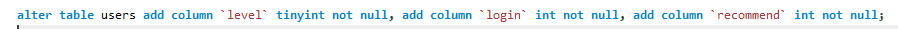

# tobys_spring_training
토비의 스프링 연습장소

3장(템플릿)
[토비의 스프링 3장](https://velog.io/@lee1231234/%ED%86%A0%EB%B9%84%EC%9D%98-%EC%8A%A4%ED%94%84%EB%A7%81-3%EC%9E%A5-%EB%8F%85%ED%95%991)

4장(예외)
[토비의 스프링 4장](https://velog.io/@lee1231234/%ED%86%A0%EB%B9%84%EC%9D%98-%EC%8A%A4%ED%94%84%EB%A7%81-4%EC%9E%A5-%EB%8F%85%ED%95%99)

5장(서비스 추상화)[토비의 스프링 5장]()

트러블 슈팅(나중에 문서화 할것)

FAILURE: Build failed with an exception 오류

해결방법
인텔리제이 setting에서 gradle을 자기 자신의 gradle로 만들것.

널포인터를 만나는 파일읽기

해결방법 브레이크 포인트를 사용한 문제 인식

분명 리소스에 들어간 값인데 null로 뜬다

경로 지정을 제대로 해주면 확인이 가능함.

캐시값이 엄청나게 커지는 경우가있다. 이런경우 확인해서 캐시를 한번 지워주는것이 좋다.

만약 문제가 생긴다면 두가지 방법을 취할것.
1. 코드는 돌아가는데 정상적으로 동작하지않을때.
    
    브레이크 포인트를 걸고 디버깅 모드로 들어가 내가 생각하는데로 작동하는지 확인할것. 
2. 코드 자체가 에러가 뜬다면

    오류메세지 확인후 처리가 가능한 오류라면 해결하고 아니면 구글링을 통해 해결방법을 찾아볼것.

alter add 여러개

Test class should have exactly one public zero-argument constructord의 대한 에러가 생성됨
이유가 뭐지 싶었는데 생각해보니까 인터페이스에서 받은 DAO를 수정한적이 없었음. 테이블의 컬럼이 5개가 되었는데 3개만 사용하니 제대로 작동하지 않은것.
